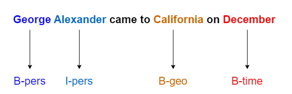

# Named-Entity-Recognition
This repo for NAmed Entity Recognition (NER) using LSTM.

NER tags words in a text and distinguish the words which represent geographical places, names, time, etc. 

## Dataset
Refer to `data` directory for the dataset

## Notebook 
The provided notebook includes the following: 

- Exploring the dataset
- Reading the dataset and preprocessing
- Vocabulary 
- Creating NER model 
- Train NER model 
- Test the model on your own sentence

Enjoy it :) 

